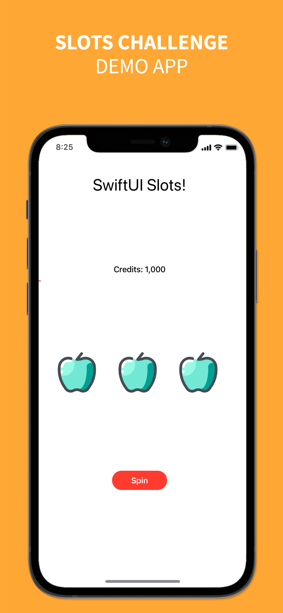

# SlotsChallenge

A simple application to learn about SwiftUI and it's part of [14 Day Beginner Challenge (SwiftUI)](https://learn.codewithchris.com/courses/take/start/lessons/19146005-lesson-13-bonus-challenge) from [CodeWithChris](https://learn.codewithchris.com/collections)

## Functinality
There are three fruit image and 1,000 credits. When user taps on Spin button, all the image will randomly change. If all 3 images match to each other then credit will increase by 15 otherwise decrease by 5.

## App Preview
   

## License

MIT

**Free Software, Hell Yeah!**
