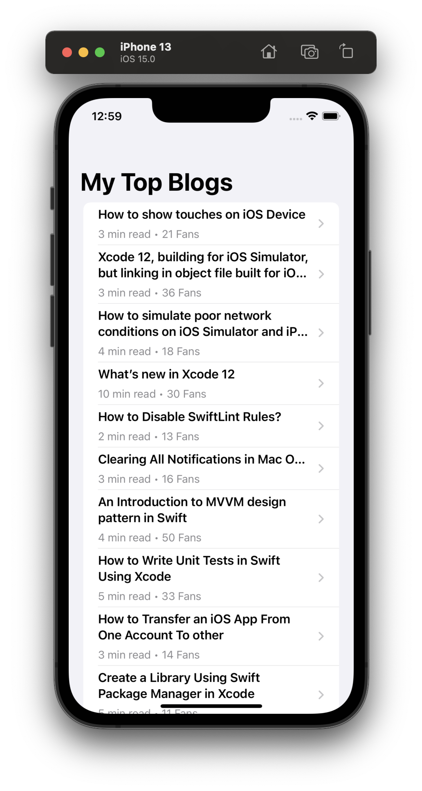
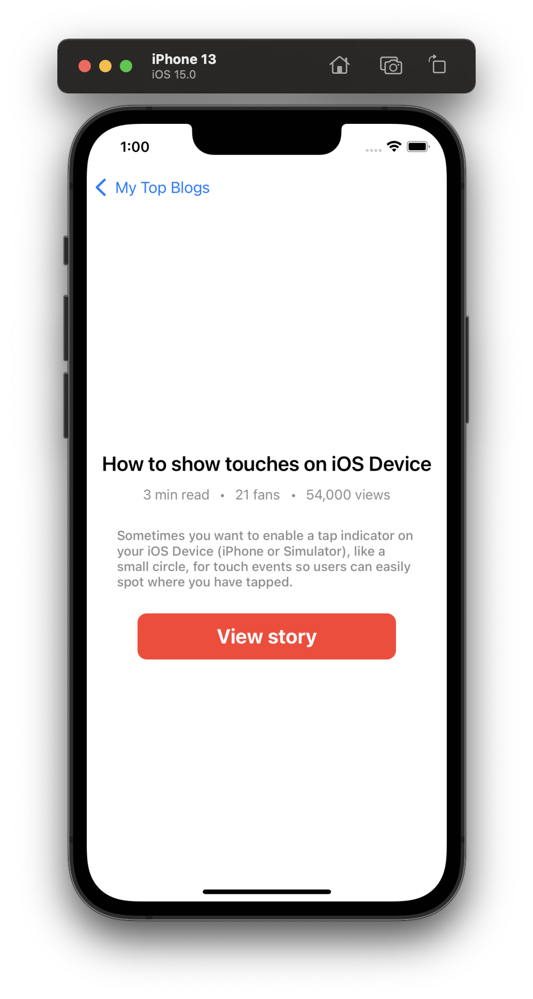

# SwiftUIList

A simple SwiftUI list application to learn about SwiftUI list. It's part of [SwiftUI List with Custom Cell & Passing Data](https://www.youtube.com/watch?v=k5rupivxnMA&list=PL8seg1JPkqgHyWCBHwXGmfysQpEQTfC3z) from [Sean Allen](https://www.youtube.com/channel/UCbTw29mcP12YlTt1EpUaVJw)

## App Preview

   
        
    

## License

MIT

**Free Software, Hell Yeah!**
