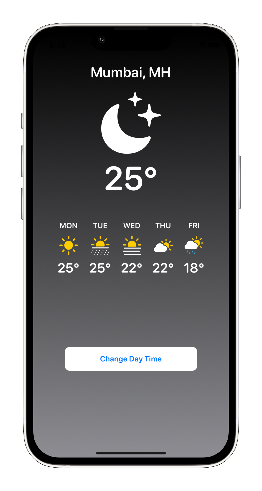

# WeatherApp

A simple weather application to learn about SwiftUI and it's part of [SwiftUI Basics Tutorial](https://www.youtube.com/watch?v=HXoVSbwWUIk&t=1055s) from [Sean Allen](https://www.youtube.com/channel/UCbTw29mcP12YlTt1EpUaVJw)

## Functinality
Simple weather application that shows current weather status and forecasts for the next 5 days, as well as a button that changes the visibility according to day or night.

## App Preview

   
    
    

## License

MIT

**Free Software, Hell Yeah!**
